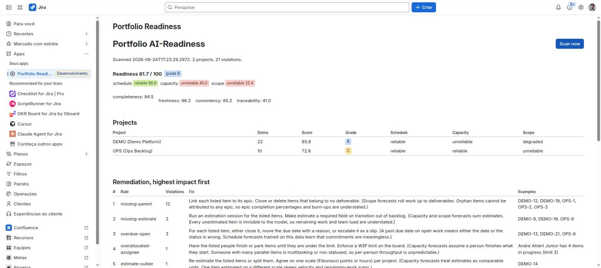

# portfolio-lint

[](https://github.com/andreahlert/portfolio-lint/actions/workflows/ci.yml) MIT licensed.

Lint your project portfolio before you let AI forecast it.

`portfolio-lint` is the reference implementation of the **Portfolio AI-Readiness Framework**:
thirteen deterministic rules that score how ready a portfolio's data is for schedule, capacity and scope
forecasting, and tell you what to fix first. It then runs the forecast itself: a Monte Carlo on each
project's real throughput plus a critical path over the dependency graph, so you see p50/p85/p95 dates,
which items are on the critical path, and how many weeks of uncertainty come from data you can fix today.
It runs on Jira Cloud (CLI and native Forge app) and on any tool that can export CSV.

```
Portfolio readiness: 85.4 / 100  grade B

forecast  score  label
--------  -----  --------
schedule  75.0   reliable
capacity  68.8   degraded
scope     77.1   reliable

Delivery forecast (Monte Carlo on 12 weeks of throughput, 2000 runs, seed 42)
project  unit    open  unestimated  throughput/wk  p50                p85                commitment                  confidence
ERPMIG   points  241   19           43.3           2027-03-22 (30w)   2027-04-12 (33w)   2026-11-03 late (+22.9w)    high
ERPPMO   points  119   77           5.0            2028-10-30 (114w)  2029-04-23 (139w)  2026-11-05 late (+128.6w)   low

What limits each forecast
  ERPPMO
    - only 3 of the last 12 weeks have completed work
    - 77 of 119 open items (65%) have no estimate
    - estimate the 77 unestimated items and p85 moves from 2029-04-23 to 2028-09-18 (31 weeks of uncertainty removed)
    - critical path (2 items, 15 points): ERPPMO-228 -> ERPPMO-206

Remediation (highest impact first)
1  missing-estimate            2  Run an estimation session for the listed items...   ALPHA-15, BETA-15
2  missing-parent              2  Link each listed item to its epic...                ALPHA-16, BETA-18
3  status-resolution-mismatch  2  Fix the workflow so the done transition sets...     ALPHA-20, ALPHA-22
```

## Why

Jira, monday, Planview and Planisware all ship AI forecasting now. They all read the same work items.
If a third of the stories have no estimate and half the epics have no date, the forecast is confident noise.
Existing "hygiene" apps score individual issues or admin configuration. Nothing scores the portfolio,
across tools, and maps each finding to the forecast it breaks. This does.

Read the [framework](docs/framework.md), the [rule catalogue](docs/rules.md) and the
[agent governance guide](docs/governance.md) for PMOs running AI agents on portfolio data.

## Quick start

Requires Node 20 or newer.

```bash
git clone https://github.com/andreahlert/portfolio-lint
cd portfolio-lint
npm install
npm run build
npm run scan:example          # scans examples/sample-portfolio.csv
```

### Scan Jira Cloud

```bash
export JIRA_URL=https://acme.atlassian.net
export JIRA_EMAIL=you@acme.com
export JIRA_TOKEN=...          # https://id.atlassian.com/manage-profile/security/api-tokens
node packages/cli/dist/bin.js scan --source jira --projects ALPHA,BETA --format md --out readiness.md
```

### Scan a CSV export

Any tool works if you can produce the columns in [docs/csv-format.md](docs/csv-format.md).

```bash
node packages/cli/dist/bin.js scan --file export.csv --format json --out readiness.json
```

### Try it on a realistic portfolio

`examples/erp-portfolio.csv` is a synthetic SAP-style ERP programme: 8 workstreams (finance, supply chain, manufacturing, HR, integrations, data migration, analytics, PMO), about 3,600 items, 3,300 dependency links (some across projects), and hygiene noise that differs per workstream. It is generated, deterministic and free of real data.

```bash
npm run scan:erp                     # scan it
npm run gen:erp                      # regenerate (see scripts/gen-erp-portfolio.mjs for --seed, --scale, --now)
```

`scripts/seed-jira-from-csv.py` loads any portfolio-lint CSV into a Jira Cloud site (projects, epics, links, transitions) to try the Forge app at scale.

### Gate it

```bash
node packages/cli/dist/bin.js scan --file export.csv --fail-under 75   # exit 1 when below
```

Exit codes: `0` ok, `1` score below `--fail-under`, `2` usage, connection or format error.

### Options

| Option | Meaning |
|---|---|
| `--source jira\|csv` | Defaults to csv when `--file` is given |
| `--format table\|md\|json` | Default table |
| `--out <path>` | Write the report to a file |
| `--config <path>` | Thresholds, defaults to `.portfoliolintrc.json` if present |
| `--fail-under <score>` | CI gate |
| `--now <iso>` | Freeze time for reproducible runs |
| `--name <name>` | Portfolio name in the report |

`portfolio-lint rules` lists the rules; `rules --format md` regenerates `docs/rules.md`.

### Config file

```json
{
  "staleInProgressDays": 14,
  "staleOpenDays": 90,
  "maxWipPerPerson": 3,
  "wipOutlierFactor": 2,
  "wipHardLimit": 10,
  "wipAdaptiveMinPeople": 3,
  "outlierFactor": 5,
  "disabledRules": ["estimate-outlier"],
  "projects": {
    "OPS": { "staleInProgressDays": 30, "disabledRules": ["missing-parent"] }
  },
  "forecast": { "enabled": true, "historyWeeks": 12, "simulations": 2000, "seed": 42 }
}
```

Every key is optional. `projects` overrides thresholds for one project key (its `disabledRules` add to the
portfolio list). The WIP limit adapts to the team: with at least `wipAdaptiveMinPeople` people in progress it
becomes `max(maxWipPerPerson, wipOutlierFactor x team median)`, never above `wipHardLimit`, so a busy team is
compared with itself instead of a fixed number. `--no-forecast` skips the Monte Carlo pass.

## How scoring works

- Rule score = `100 * (1 - violations / applicable)`; rules with nothing applicable are skipped.
- Dimension (completeness, freshness, consistency, traceability) = weighted mean of its rules.
- Project = mean of dimensions. Portfolio = item-weighted mean of projects.
- Forecast label (schedule, capacity, scope) = minimum score among the rules that feed it: reliable >= 75, degraded >= 50, unreliable below.
- Remediation priority = `(100 - score) * weight * applicable`, so a heavy rule failing on many items rises to the top.
- Dependencies resolve across the whole scan, so a link into another scanned project is not "broken".

## How the delivery forecast works

- Throughput = completed work per week over the last `historyWeeks` (12), from `resolvedAt`. In points when at least half of the completed items are estimated, otherwise in items.
- Monte Carlo: each run draws a week of throughput at random from that history until the open work is gone. Unestimated items draw a size from the project's own estimate distribution. p50/p85/p95 are the weeks by which 50/85/95% of runs finish.
- Scope uncertainty: the same simulation with every unestimated item pinned to the project's median estimate. The p85 difference is how many weeks the missing estimates alone add, which is what "estimate these N items" buys you.
- Critical path: longest chain by estimate through the open items of the whole scan (dependencies cross projects), with the items on it that have missing estimates, no assignee, stale updates or overdue dates. Dependency cycles are reported, not silently dropped.
- Commitment: p85 against the latest due date on an open epic. on-track (p85 before it), at-risk (p50 before, p85 after), late (p50 after).
- Confidence: high, medium or low from the throughput history length, share of unestimated work, critical path gaps, cycles and throughput variance. The reasons are listed, not hidden.

Full detail in [docs/framework.md](docs/framework.md).

## Jira app (Forge)

`apps/forge` is a native Jira Cloud app: portfolio and project pages, a daily scheduled scan, and a
Rovo agent ("Portfolio Readiness Advisor") that answers "what should we fix first" and "when will this finish"
from the latest report. Both pages have a Delivery forecast tab (dates, commitment verdict, critical path, fix-first list).
Rule documentation lives in a Docs tab inside the app, a Settings tab lets Jira admins tune thresholds and turn
rules on or off (project admins can override them per project), and every fixable finding has a Fix button that
writes the correction to Jira as the current user (estimate, assignee, due date, parent, transition).
Data never leaves Atlassian. See [apps/forge/README.md](apps/forge/README.md).



Screenshot from a Jira Cloud dev site (Portuguese locale) with two seeded projects; the mapper reads issue type hierarchy levels, so localized sites work out of the box.

## Repository

```
packages/core   rules, scorer, canonical model, CSV parser, Jira mapper (no I/O)
packages/cli    portfolio-lint command: Jira connector, renderers, config
apps/forge      Jira Cloud app (UI Kit, scheduled trigger, Rovo agent)
docs/           framework, rules, csv-format, governance, design
examples/       sample portfolio with planted violations, generated ERP programme (3.6k items)
scripts/        ERP portfolio generator, Jira seeder
```

```bash
npm test -ws                         # core + cli tests
npm run typecheck -w portfolio-lint-forge
```

## Roadmap

- Connectors: Azure DevOps, Asana, Linear.
- Capacity supply rules (availability, leave) once a people source exists.
- Assignee view: who is on the critical path and overloaded at the same time.
- Readiness badge for READMEs and portfolio dashboards.

## License

MIT. Built by [André Ahlert](https://www.linkedin.com/in/ahlert).
